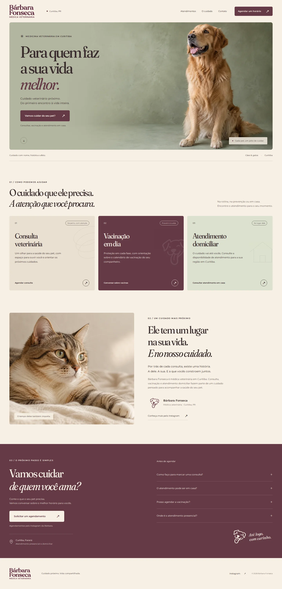

# Bárbara Fonseca — site veterinário

Site institucional compacto, em português, com foco em solicitações de agendamento em Curitiba. Vite + TypeScript, HTML estático e CSS próprio; sem backend, sem framework de UI e sem rastreamento de terceiros.

## Rodar

Node.js 22.12+ (ou 20.19+).

```sh
npm ci
npm run dev
npm run build
npm run preview
npm test
```

A saída de produção é `dist/`. Pode ser servida por qualquer hospedagem estática. As pastas originais `Barbara/` são arquivos de marca e não entram no build.

## Configuração de contato e publicação

Copie `.env.example` para `.env.local` e configure apenas dados confirmados:

| Variável | Tipo | Efeito |
| --- | --- | --- |
| `VITE_WHATSAPP_NUMBER` | **Config pública**, não é Secret | Número brasileiro com `55` + DDD + número, só dígitos. Ativa links `wa.me` com mensagem por serviço. Sem número, o site direciona ao Instagram `@barbarafonsecavet`. |
| `VITE_SITE_URL` | **Config pública**, não é Secret | Origem HTTPS do domínio final. Ativa canonical, indexação, sitemap, URL e imagem social absoluta. Sem domínio, gera `noindex` e bloqueio no robots. |

Nunca coloque credenciais em variáveis `VITE_*`: elas são públicas. Preview e produção precisam de builds separados; configure o domínio apenas no ambiente de produção. Não use um domínio de preview como domínio canônico.

Para publicar: build command `npm run build`; output directory `dist`. Nenhuma publicação, merge ou configuração de domínio é feita automaticamente por este projeto.

## Experiência de agendamento

CTAs no cabeçalho, hero, serviços, contato e barra móvel abrem um diálogo acessível com o atendimento selecionado. O usuário continua no canal configurado. No Instagram, pode copiar a mensagem e enviá-la no direct; no WhatsApp, ela já abre preenchida. O site não diz que o agendamento está confirmado e não armazena dados pessoais. Os links funcionam sem JavaScript, inclusive com WhatsApp após o build.

Eventos locais `barbara:booking` permitem conectar analytics no futuro, sem incluir conteúdo pessoal:

```js
window.addEventListener('barbara:booking', ({ detail }) => {
  // detail: action, service, placement, channel
  // action: open | copy_message | contact_click
  // Conta intenção de contato; não representa agendamento confirmado.
});
```

## Identidade e conteúdo

- Logotipo e símbolo originais de `Barbara/Brand`; paleta extraída dos próprios arquivos: ameixa `#653A47`, creme `#F7F0E4`, sálvia `#A0AD90`.
- Fraunces e Montserrat, coerentes com os materiais de marca nas branches de apresentação e motion. O logotipo permanece a arte original.
- Fotografias de campanha dos pets geradas para este site. Nenhuma foto de pessoa representa a Bárbara; nenhuma foto apresenta um ambiente como consultório real.
- Não foram usados os retratos em `Barbara/Barbara`, nem o layout de site presente nos mockups do repositório.
- Nenhum depoimento, número de registro profissional, telefone, endereço completo, horário de funcionamento, especialidade ou promessa clínica foi inventado.
- Produtos/pet shop ficaram fora da narrativa principal para manter o foco em agendamento.

## Antes da publicação final

Confirmar telefone oficial, domínio final, endereço de atendimento e os dados profissionais que a Bárbara deseja exibir. Hoje a página informa apenas Curitiba e encaminha a localização na conversa, sem pins ou rotas inventados. O conteúdo pode ser revisado em `index.html`, contato em `src/booking.mjs`, estilos em `src/style.css` e SEO de produção em `scripts/seo.mjs`.

Veja `docs/direcao-e-validacao.md` para decisões e validação; `docs/imagens.md` para origem e prompts dos assets.

## Prévia visual

### Desktop



[Ver mobile](docs/preview-mobile.webp) · [Ver agendamento](docs/preview-agendamento.webp)
